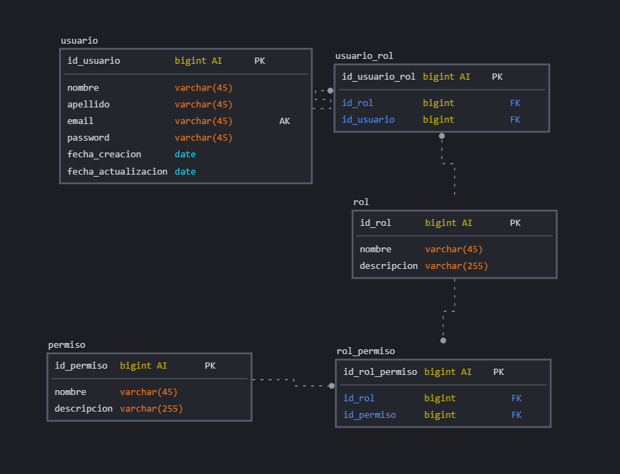

# Autenticacion

## Lista de Entidades

### usuario 
- id_usuario **(PK)**
- nombre
- apellido
- email **(UQ)**
- contrasena
- id_rol **(FK)**

### rol
- id_rol **(PK)**
- nombre
- descripcion
- id_usuario **(FK)**
- id_permiso **(FK)**

### permiso
- id_permiso **(PK)**
- nombre
- descripcion
- id_rol **(FK)**

### rol_permiso
- id_usuario_permiso **(PK)**
- id_rol **(FK)**
- id_usuario **(FK)**

### usuario_rol
id_usuario_rol **(PK)**
id_rol **(FK)**
id_usuario **(FK)**

## Relaciones

1. Usuarios tiene roles (_M_M_)
1. Roles tienen Permisos (_M_M_)

### Modelo Relacional de la Base de Datos

## Regla de negocio

### usuario

1. CRUD a usuario

### rol

1. CRUD  a rol

### permiso

1. CRUD a permiso

### rol_permiso

1. CRUD a rol_permiso

### usuario_rol

1. CRUD a usuario_rol 