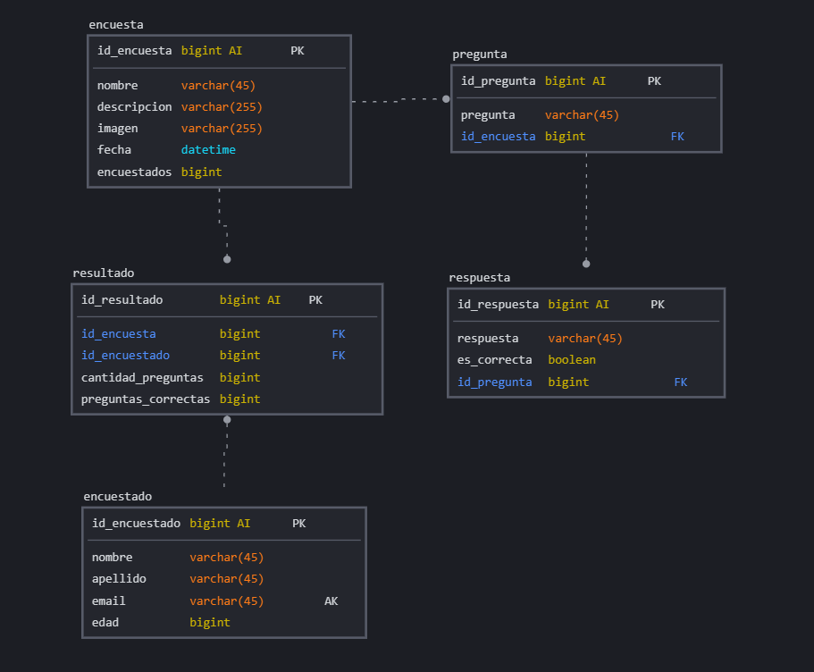

# Encuesta

## Listado de Entidades

### encuesta **(ED)**

- id_encuesta **(PK)**
- id_pregunta **(FK)**
- nombre
- descripcion
- imagen
- fecha
- encuestados

### pregunta **(ED)**

- id_pregunta **(PK)**
- pregunta

### respuesta **(ED)**

- id_respuesta **(PK)**
- id_pregunta **(FK)**
- respuesta
- es_correcta

### encuestado **(ED)**

- id_encuestado **(PK)**
- nombre
- apellido
- edad
- email

### resultado **(ED|EP)**

- id_resutado **(PK)**
- id_encuesta **(FK)**
- id_encuestado **(FK)**
- cantidad_preguntas
- preguntas_correctas

## Relaciones

1. Una **encuesta** tiene  **preguntas**  (_1_M_) 
1. Una **pregunta** tiene  **respuestas** (_1_M_)
1. Una **encuesta** tiene  **resultados** (_1_M_)
1. Un **encuestado** tiene **resultados** (_1_M_)

### Modelo Relacional de la Base de Datos

## Regla de negocio

### encuesta

1. CRUD a encuesta
1. Aumentar en 1 el valor de encuestados cada vez que la encuesta se complete

### pregunta

1. CRUD a pregunta

### respuesta

1. CRUD a respuesta

### encuestado

1. CRUD a encuestado
1. El email no se puede repetir, si no existe email registrado comenzar la     encuesta. Caso contrario no

### resultado

1. CRUD a resultado
1. sumar todas las preguntas que hay en la encuesta
1. Determinar cuantas preguntas han sido respondidas correctamente

