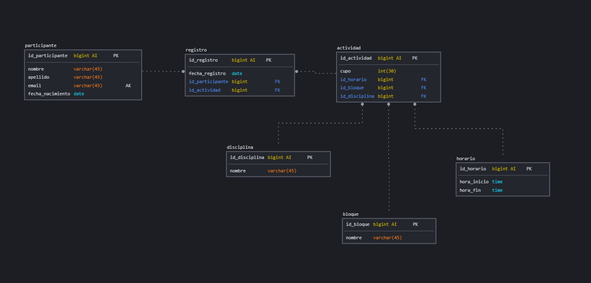

# Entrena Tu Glamour

## Requisitos del Sistema
- Registrar participantes para el evento Entrena tu Glamour.
- El evento tendrá 4 disciplinas: KickBoxing, Pilates, Yoga y Zumba.
- Cada disciplina tendrá 3 bloques de horarios:
- Bloque 1 de 9:00 a 12:00
- Bloque 2 de 14:00 a 17:00
- Bloque 3 de 18:00 a 21:00
- Cada actividad tendrá un máximo de 10 participantes, excepto Yoga que tendrá 20.
- Cada participante sólo se podrá registrar a una sóla actividad.

## Listado de Entidades

### participante **(ED)**
- id_participante **(PK)** **(AI)**
- nombre
- apellido
- email **(UQ)**
- fecha_nacimiento

### actividad **(ED)**
- id_actividad **(PK)** **(AI)**
- id_bloque **(FK)**
- id_disciplina **(FK)**
- id_horario **(FK)**
- cupo

### horario
- id_horario  **(PK)** **(AI)**
- hora_inicio
- hora_fin

### bloque **(EC)**
- id_bloque **(PK)** **(AI)**
- nombre

### disciplina **(EC)**
- id_disciplina **(PK)** **(AI)**
- nombre

### registro **(EP)**
- id_registro **(PK)** **(AI)**
- id_persona **(FK)**
- id_actividad **(FK)**
- fecha_registro 

## Relaciones

1. Un **participante** crea un **registro** (_1_1_)
1. Un **horario** admite muchas **actividades** (_1_M_)
1. Una **actividad** crea muchos**registros** (_1_M_)
1. Una **actividad** admite muchos **horarios** (_1_M_)
1. Una **actividad** admite muchos **bloques** (_1_M_)
1. Una **actividad** admite muchas **disciplinas** (_1_M_)

### Modelo Relacional de la Base de Datos

## Regla de negocio

### participante

1. Crear participante
1. Eliminar participante
1. Leer todos los participantes
1. Leer un participante 

### registro

1. Crear registro
1. Eliminar registro
1. Leer todos los registro
1. Leer un registro 
1. Actualizar un registro

### actividad

1. Crear acividad
1. Eliminar acividad
1. Leer todos las acividad
1. Leer una acividad 
1. Actualizar una actividad

### horario

1. Crear horario
1. Eliminar horario
1. Leer todos las horario
1. Leer una horario 
1. Actualizar una horario

### bloque

1. Crear bloque
1. Eliminar bloque
1. Leer todos las bloque
1. Leer una bloque 
1. Actualizar una bloque

### disciplina

1. Crear disciplina
1. Eliminar disciplina
1. Leer todos las disciplina
1. Leer una disciplina 
1. Actualizar una disciplina

### Logica y validacion de requisitos

1. Insertar un participante implica:
    2. quitar un cupo
1. Eliminar un participante implica:
    2. retornar el cupo