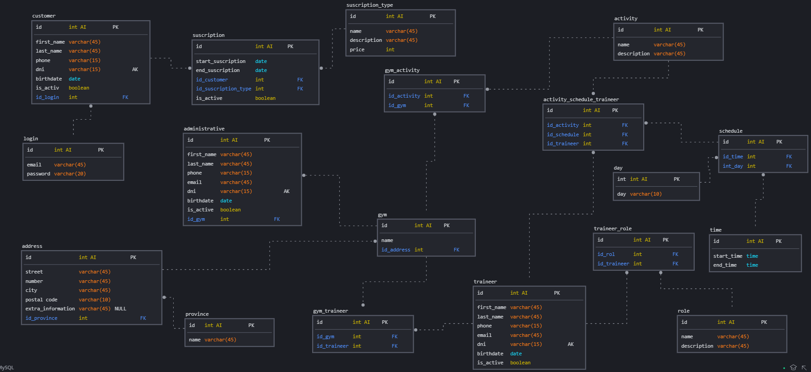

# Gym Data Base

## Business Plan

1. The business system consists of controlling the classes and activities to which a user registers through a web page and from a mobile App. The client with his ID registers in the account (this data is unique) and provides a password, in order to manage his account.
1. In the gym there are scheduled hours and classes. But for the bodybuilding sector it is free to access at any time.
1. There will be teachers, who can be assigned to many activities depending on how qualified they are and their schedule and work in many gyms.
1. Classes will be defined on a specific day and time.
1. There will be different types of subscriptions which, depending on the subscription, will allow bodybuilding as a base and add one or more extra activities to the subscription.
1. Form of payment: if the amount is equivalent to 3, 6 months or 1 year, a discount will be applied.
1. If the client does not pay for the month, he will cease to be active.
1. If the traineer gets sick and leaves, he will be inactive until he recovers.

## Entity Relationship

1. Many **activities** have many **schedules** (_M_M_)
1. A **schedule** have many **days** (_1_M_)
1. A **schedule** have many **times** (_1_M_)
1. A **customer** have one **adresse** (_1_1_)
1. A **customer** make many **payments** (_1_M_)
1. A **customer** make one **suscription** (_1_1_)
1. A **traineer** have one **adresse** (_1_1_)
1. A **traineer** have many **activity_schedule** (_M_M_)
1. Many **traineer** have many **roles** (_M_M_)
1. Many **gyms** have many **traineers** (_M_M_)
1. A **gym** have one **address** (_1_1_)
1. A **gym** have many **administratives** (_1_M_)
1. A **suscription** have one **suscription_type** (_1_1_)
1. A **suscription** have one **customer** (_1_1_)
1. A **suscription** many **gyms** (_1_1_)

## Entity Relationship Diagram

