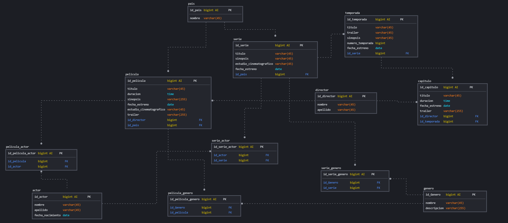

# Peliculas y Series

## Lista de Entidades

### pelicula **(ED)**
- id_pelicula **(PK)** **(AI)**
- titulo
- duracion
- sinopsis
- fecha_estreno
- estudio_cinematografico
- id_director **(FK)**
- id_pais **(FK)**
- trailer

### pais  **(EC)**
- id_pais **(PK)** **(AI)**
- nombre

### serie  **(ED)**
- id_serie **(PK)** **(AI)**
- titulo
- sinopsis
- estudio_cinematografico
- fecha_estreno
- id_pais **(FK)**

### temporada **(ED)**
- id_temporada **(PK)** **(AI)**
- id_serie **(FK)**
- numero_temporada
- fecha_estreno
- titulo
- trailer

### capitulo **(ED | EP)**
- id_capitulo **(PK)** **(AI)**
- titulo
- duracion
- id_temporada **(FK)**
- fecha_estreno
- id_director **(FK)**
- trailer

### actor **(ED)**
-id_actor **(PK)** **(AI)**
- nombre
- apellido
- fecha_nacimiento

### director **(ED)**
- id_director **(PK)** **(AI)**
- nombre
- apellido

### pelicula_actor **(EP)**
- id_pelicula_actor **(PK)** **(AI)**
- id_pelicula **(FK)**
- id_actor **(FK)**

### serie_actor **(EP)**
- id_serie_actor **(PK)** **(AI)**
- id_serie **(FK)**
- id_actor **(FK)**

### genero **(EC)**
- id_genero **(PK)** **(AI)**
- nombre
- descripcion

### pelicula_genero **(EP)**
- id_pelicula_genero **(PK)** **(AI)**
- id_pelicula **(FK)**
- id_genero **(FK)**
 
### serie_genero **(EP)** 
- id_serie_genero **(PK)** **(AI)**
- id_serie **(FK)**
- id_genero **(FK)**

## Relaciones
1. Una **pelicula** tiene muchos **países** (_1_M_)
1. Una **serie** tiene muchos **países** (_1_M_)
1. Muchas **temporadas** pertenecen a una **serie** (_1_M_)
1. Muchos **capitulos** pertenecen a una **temporada** (_1_M_)
1. Mcuhas **películas** tienen muchos **géneros** (_M_M_)
1. Muchas **series** tienen muchos **géneros** (_M_M_)
1. Muhcos **actores** trabajan en muchas **peliculas** (_M_M_)
1. Muhcos **actores** trabajan en muchas **series** (_M_M_)

### Modelo Relacional de la Base de Datos

## Regla de negocio

### pelicula
1. Crear una película.
1. Leer todas las películas.
1. Leer una película en particular.
1. Actualizar una película.
1. Eliminar una película.

### serie
1. Crear una serie.
1. Leer todas las series.
1. Leer una serie en particular.
1. Leer las temporadas de una serie.
1. Leer los episodios de una serie.
1. Actualizar una serie.
1. Eliminar una serie.

### temporada
1. Crear una temporada.
1. Leer todas las temporadas.
1. Leer una temporada en particular.
1. Leer los episodios de una temporada.
1. Actualizar una temporada.
1. Eliminar una temporada.

### capitulo
1. Crear un capitulo.
1. Leer todos los capitulo.
1. Leer un episodio en particular.
1. Actualizar un capitulo.
1. Eliminar un capitulo.

### pais
1. Crear un pais.
1. Leer todos los paises.
1. Leer un país en particular.
1. Actualizar un país.
1. Eliminar un país.

### genero
1. Crear un género.
1. Leer todos los géneros.
1. Leer un género en particular.
1. Actualizar un género.
1. Eliminar un género.

### actor
1. CRUD a actor

### director
1. CRUD a director

### pelicula_genero
1. Crear una pelicula_genero.
1. Leer los géneros de una película.
1. Eliminar una pelicula_genero.

### serie_genero
1. Crear una serie_genero.
1. Leer los géneros de una serie.
1. Eliminar una serie_genero.

### actor_serie
1. Crear un actor_serie.
1. Eliminar un actor_serie.
1. Leer los actores de una serie.

### actor_pelicula
1. Crear un actor_pelicula.
1. Eliminar un actor_peiucla.
1. Leer los actores de una pelicula.
