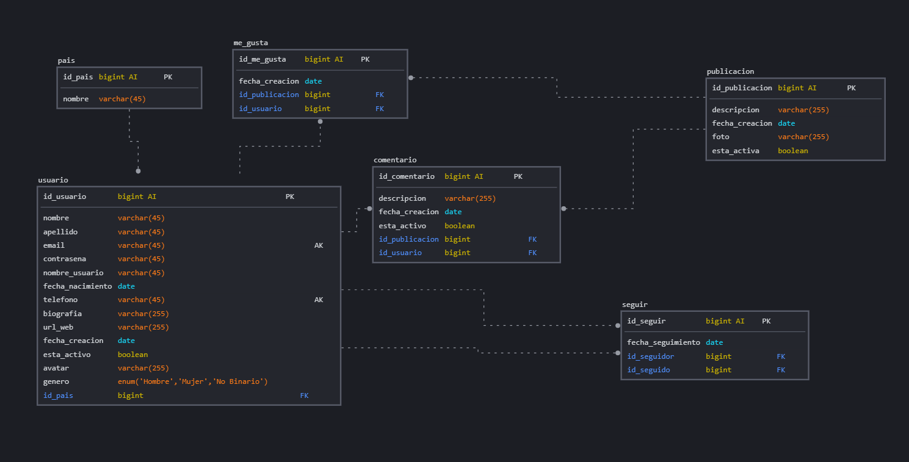

# Red Social

## Listado de Entidades

### publicacion **(ED)**
- id_post **(PK)** **(AI)**
- fecha_creacion
- descripcion
- foto
- id_usuario **(FK)**
- esta_activa

### usuario **(ED)**
- id_usuario **(PK)** **(AI)**
- nombre
- apellido
- nombre_usuario
- email **(UQ)**
- contrasena
- fecha_nacimiento
- telefono **(UQ)**
- biografia
- avatar
- genero
- id_pais **(FK)**
- url_web
- fecha_creacion
- esta_activo

### pais **(EC)**
- id_pais **(PK)** **(AI)**
- nombre

### comentario **(ED | EP)**
- id_comentario **(PK)** **(AI)**
- descriocion
- id_usuario **(FK)**
- fecha_creacion
- esta_activo
- id_publicacion **(FK)**

### me_gusta **(ED | EP)**
- id_me_gusta **(PK)** **(AI)**
- id_usuario **(FK)**
- id_publicacion **(FK)**
- fecha_creacion

### seguir **(ED)**
- id_seguidor **(PK)** **(AI)**
- fecha_seguimiento
- id_seguido **(FK)**
- id_seguidor **(FK)**

## Relaciones

1. Un **usuario** crea muchas **publicaciones** (_1_M_)
1. Un **usuario** crea muchos **comentarios** (_1_M_)
1. Una **publicacion** tiene muchos **comentarios** (_1_M_)
1. Una **publicacion** tiene muchos **me_gusta** (_1_M_)
1. Un **usuario** da muchos **me_gusta** (_1_M_)
1. Un **usuario** tiene muchos **seguidores** (_1_M_)
1. Un **usuario** sigue muchos **usuarios** (_1_M_)
1. Un **usuario** tiene un **pais** (_1_1_)

### Modelo Relacional de la Base de Datos

## Regla de negocio

### publicacion 

1. CRUD a publicacion sin Update
1. Actualizar solamente la descripcion de la publicacion

### usuario

1. CRUD a usuario
1. Actualizar contrasena
1. Validar un usuario

### comentario

1. CRUD a comentario
1. Contar cantidad de comentarios en una publicacion

### pais

1. CRUD a pais

### me_gusta

1. Crear un me_gusta en una publicacion
1. Eliminar un me_gusta de una publicacion
1. Contar los me_gusta total de una publicacion

### seguir

1. Crear seguir a un usuario
1. Eliminar un seguir de un usuario
1. Contar la cantidad de seguir de un usuario
1. Contar la cantidad de seguidores de un usuario

